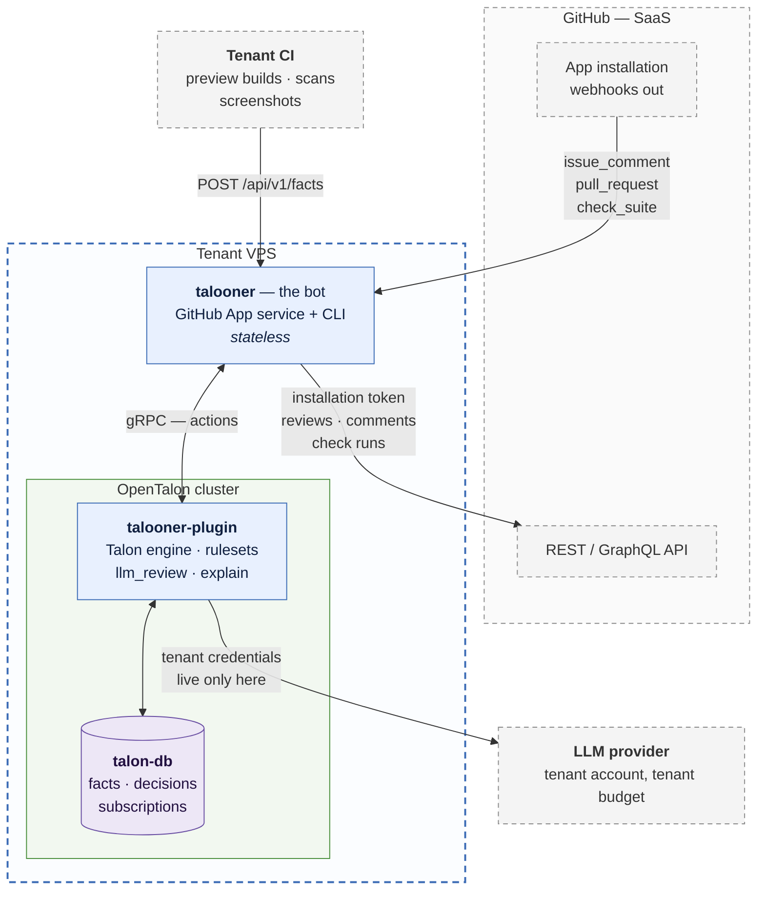
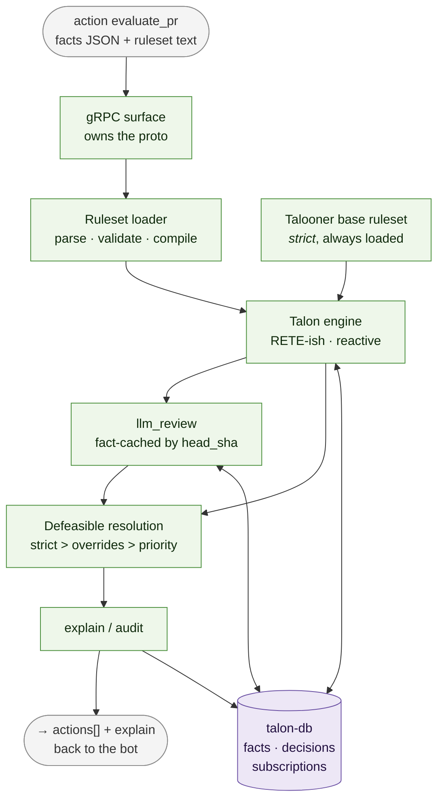
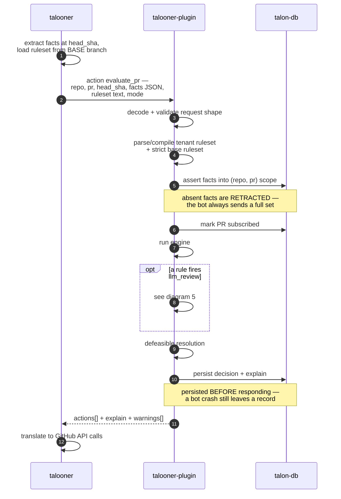
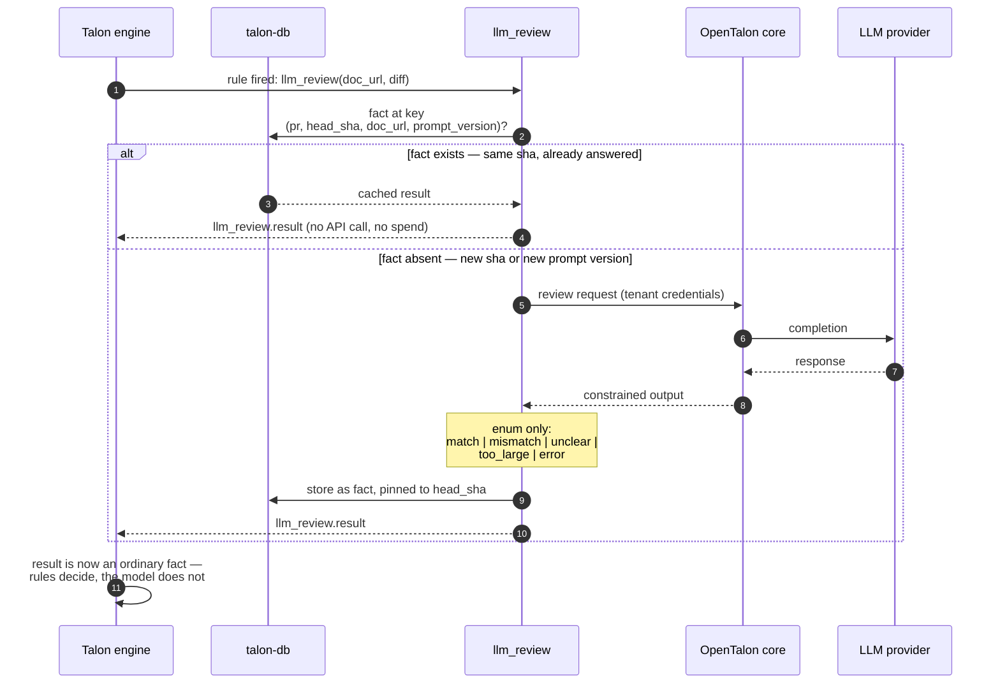
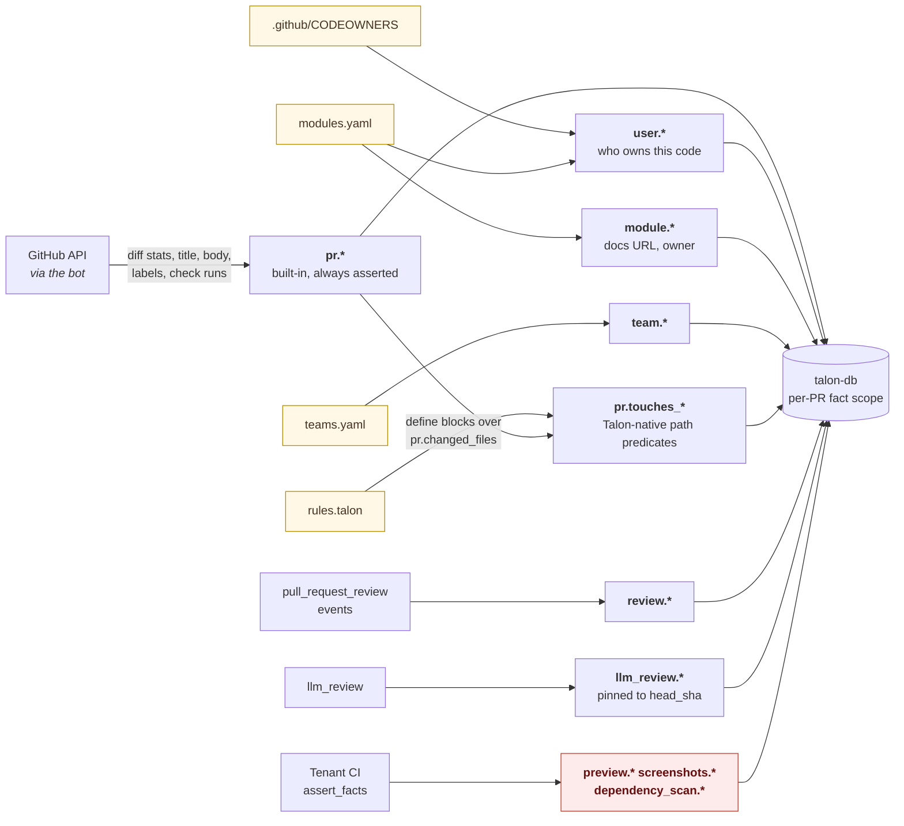

# `talooner-plugin` — design diagrams

Mermaid, so it renders on GitHub and stays diffable in review.

The full set — system context, the bot's internals, PR lifecycle, credential
blast radius — lives in
[`talooner/diagrams.md`](https://github.com/opentalon/talooner/blob/main/diagrams.md).
This file carries the ones this component is in.

**C4 for structure, UML for behaviour.** Nothing else. Not Mermaid's native
`C4Context` / `C4Container` syntax, despite following the C4 model — it's still
experimental and has no real layout engine, so relationship labels land on top of
the boxes. Plain `flowchart` renders the same model correctly.

| # | Diagram | Answers |
|---|---|---|
| 1 | Containers (C4 L2) | Where this plugin sits, and what it may talk to |
| 2 | Components (C4 L3) | Internals, in execution order |
| 3 | `evaluate_pr` | The request this component exists to serve |
| 4 | Re-evaluation and retraction | Why facts are re-derived, never deltaed |
| 5 | `llm_review` | Why there's no cache layer, and where determinism comes from |
| 6 | Fact sources | Where every fact comes from, and which ones CI may write |

All diagrams verified rendering with `mermaid-cli` 11.16.

---

## 1. Containers — C4 L2

Everything inside the dashed boundary runs on the tenant's VPS. There is no
hosted Talooner, no shared service, no third party.



Two things to read off this diagram:

- **This plugin has no arrow to GitHub.** Not "shouldn't" — doesn't. Every GitHub
  edge belongs to the bot. If one ever appears here, the seam is broken and the
  testing story goes with it.
- **The bot never touches an LLM.** Provider credentials live in the cluster and
  nowhere else. Compromise the bot, you get GitHub comment access; compromise the
  cluster, you get LLM spend. Never both.

---

## 2. Components — C4 L3

Knows Talon, knows nothing about GitHub. Prose in `engine.md`.



The seam: the plugin returns an **abstract action list**, the bot translates it
into API calls. Consequences worth stating —

- `talooner-plugin` is testable with zero GitHub fixtures.
- The bot holds no engine state, so it restarts freely.
- `rules plan` is not a separate code path. It's the same evaluation with the
  printer executor swapped in bot-side, driven by `mode: plan` here.

---

## 3. Flow — `evaluate_pr`

The bot's half is compressed; the full v1 entry-point flow (webhook verification,
write-access gate, token minting) is in `talooner/diagrams.md` §3.



---

## 4. Flow — re-evaluation and retraction

Once invoked, the PR is subscribed. This is where reactive rules
(`when "pr.files_changed" changes`) earn their keep.

```mermaid
sequenceDiagram
    autonumber
    participant Bot as talooner
    participant Plug as talooner-plugin
    participant DB as talon-db

    Bot->>Plug: action is_subscribed — repo, pr

    alt not subscribed
        Plug-->>Bot: no
        Bot-->>Bot: drop — never reviewed unasked
    else subscribed
        Plug-->>Bot: yes
        Bot->>Bot: re-extract ALL facts at the new sha
        Note over Bot: full re-derivation, never deltas —<br/>this is what makes retraction work

        Bot->>Plug: action evaluate_pr — facts, ruleset, new_sha
        Plug->>DB: re-assert facts, retract stale ones
        Plug->>Plug: re-run engine from scratch
        Plug-->>Bot: actions[] + explain

        alt PR grew past 500 lines — approval no longer holds
            Note over Plug: the approve rule simply stops firing;<br/>no "un-approve" verb exists
            Bot->>Bot: dismiss the previous approving review
        end
    end
```

**Reversibility is not uniform**, and it is the bot that pays for it:

| Action | Reversible | On retraction |
|---|---|---|
| `approve` | yes | dismiss review, check → neutral |
| `block` | yes | check → success, dismiss REQUEST_CHANGES |
| `comment` | partly | edit to resolved state, never delete |
| `assign` / `require` | yes | remove assignee / withdraw request |
| `notify` | **no** | a sent Slack message stays sent |

`notify` being one-way is the reason it should be rare in a ruleset, and the
reason `validate_ruleset` is a reasonable place to warn about a `notify` in a
rule whose conditions churn.

---

## 5. Flow — `llm_review`, and why there is no cache layer



The fact store **is** the cache. No separate layer, no invalidation logic: a new
commit produces a new sha, the fact is absent, the model runs again.

That gives the headline property: **same head sha + same base ruleset ⇒ same
actions, byte for byte.** A per-PR conversation is retained for continuity, but
it never changes an answer already recorded.

---

## 6. Where facts come from



Everything yellow is **committed to the repo being reviewed**, under
`.github/talooner/`. The review policy is versioned, diffable, and unit-testable
with `.talon.test` — which is the claim no LLM-based reviewer can make.

The red box is the only namespace `assert_facts` may write. Enforcement lives in
this plugin: without it, a tenant CI workflow could POST `pr.tests_passing: true`
and defeat the entire ruleset. The bot filters too; this is the last line and the
one that owns the store. See `facts.md`, "Namespace enforcement lives here".

### One trap everyone working here must know about

A condition on an **unset** fact evaluates to *unknown*, not false — and
`not <unknown>` is unknown, not true. Otherwise a PR whose fact extraction failed
sails through `not is "critical_path"` and gets auto-approved.

This is a property of `talon-language`'s evaluator, not of this plugin, and it is
the first thing phase 0 verifies. See `facts.md`, "Unset is not false".
