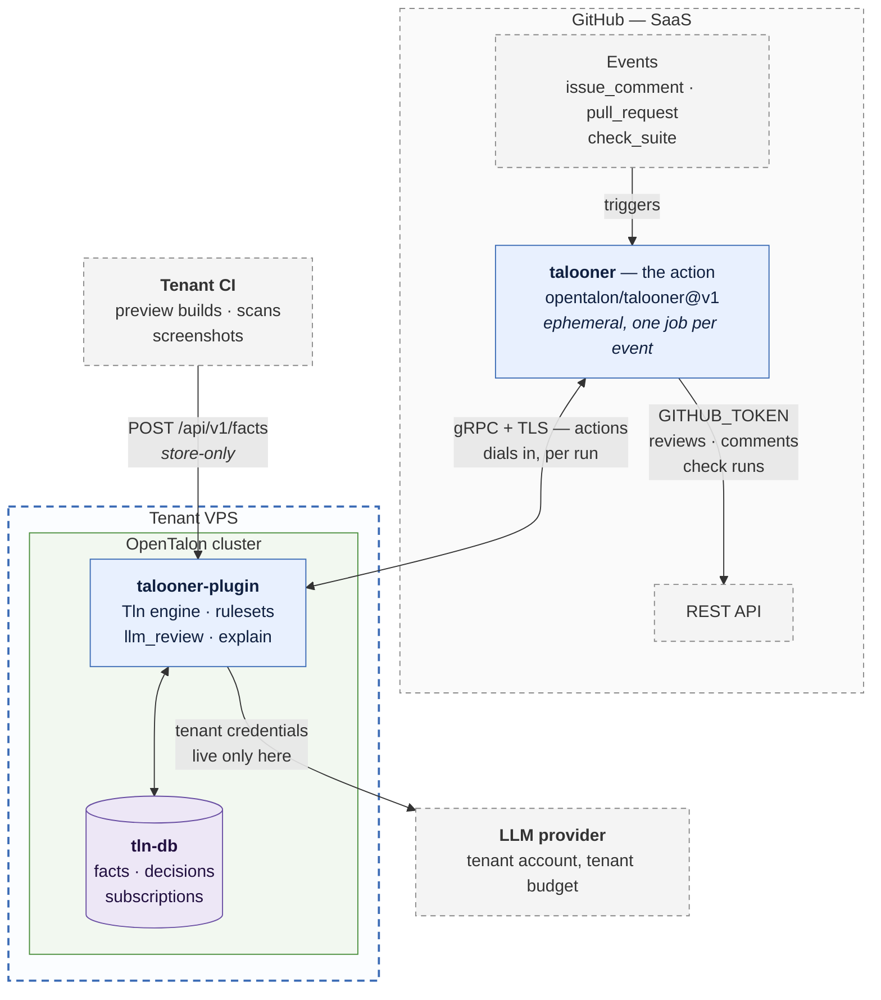
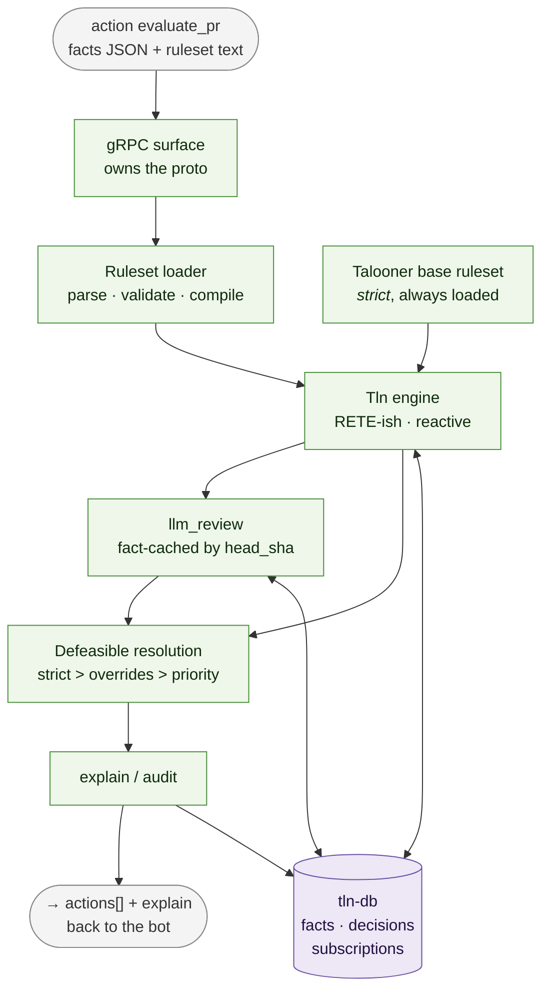
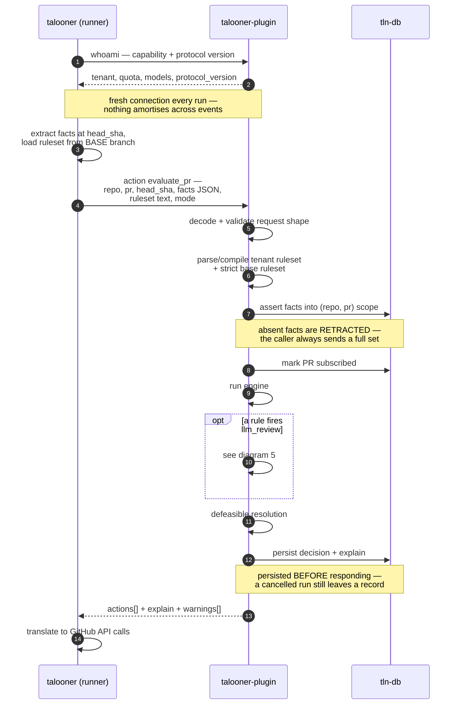
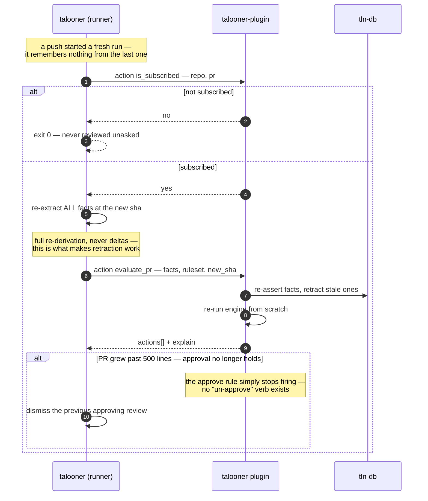
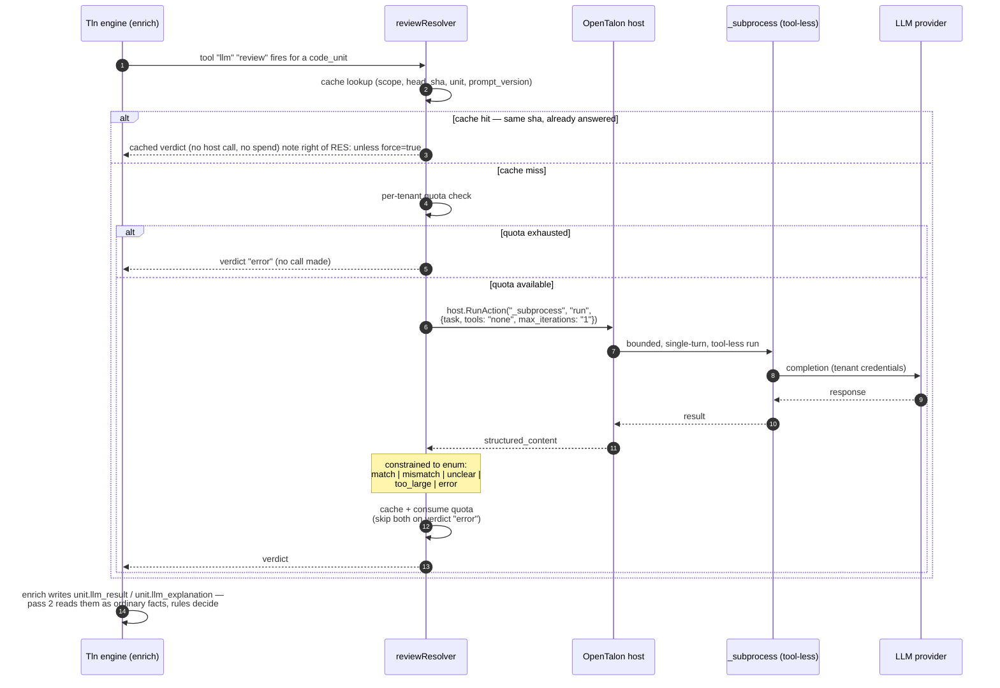
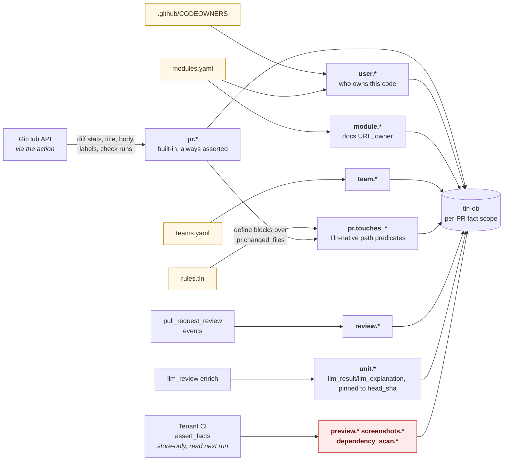

# `talooner-plugin` — design diagrams

Mermaid, so it renders on GitHub and stays diffable in review.

The full set — system context, the bot's internals, PR lifecycle, credential
blast radius — lives in
[`talooner/docs/diagrams.md`](https://github.com/opentalon/talooner/blob/main/docs/diagrams.md).
This file carries the ones this component is in.

**C4 for structure, UML for behaviour.** Nothing else. Not Mermaid's native
`C4Context` / `C4Container` syntax, despite following the C4 model — it's still
experimental and has no real layout engine, so relationship labels land on top of
the boxes. Plain `flowchart` renders the same model correctly.

| # | Diagram | Answers |
|---|---|---|
| 1 | Containers (C4 L2) | Where this plugin sits, and what it may talk to |
| 2 | Components (C4 L3) | Internals, in execution order |
| 3 | `evaluate_pr` | The request this component exists to serve |
| 4 | Re-evaluation and retraction | Why facts are re-derived, never deltaed |
| 5 | `llm_review` | The resolver-owned cache and quota, and where determinism comes from |
| 6 | Fact sources | Where every fact comes from, and which ones CI may write |

All diagrams verified rendering with `mermaid-cli` 11.16.

---

## 1. Containers — C4 L2

Only the cluster runs on the tenant's VPS. Talooner's GitHub half is an Action in
GitHub's own infrastructure (decision 1) — which is why this plugin now has a
client that dials in from outside.

Three things to read off this diagram:

- **This plugin has no arrow to GitHub.** Not "shouldn't" — doesn't. Every GitHub
  edge belongs to the action. If one ever appears here, the seam is broken and
  the testing story goes with it. It is also why nothing can happen between
  events: no outbound edge means no way to act on a fact that arrives alone.
- **The action never touches an LLM.** Provider credentials live in the cluster
  and nowhere else. Compromise a run, you get one repo's GitHub access for
  minutes; compromise the cluster, you get LLM spend. Never both.
- **Every arrow into the cluster comes from outside the VPS now.** The caller is
  a GitHub-hosted container, so the gRPC surface has to be exposed, authenticated
  and rate-limited — `deployment.md`, "Exposing the cluster".

---

## 2. Components — C4 L3

Knows Tln, knows nothing about GitHub. Prose in `engine.md`.

The seam: the plugin returns an **abstract action list**, the bot translates it
into API calls. Consequences worth stating —

- `talooner-plugin` is testable with zero GitHub fixtures.
- The caller holds no engine state, which is what lets it be a process that exits
  after every event.
- `rules plan` is not a separate code path. It's the same evaluation with the
  printer executor swapped in bot-side, driven by `mode: plan` here. The response
  carries a distinct `plan[]` field and no `actions` key, so plan output can't
  reach the GitHub executor even if a caller forgets to check the mode
  (`OPEN-QUESTIONS.md` B4).

---

## 3. Flow — `evaluate_pr`

The caller's half is compressed; the full v1 entry-point flow (workflow trigger,
write-access gate, `GITHUB_TOKEN`) is in `talooner/diagrams.md` §3.

---

## 4. Flow — re-evaluation and retraction

Once invoked, the PR is subscribed. This is where reactive rules
(`when "pr.files_changed" changes`) earn their keep.

**Reversibility is not uniform**, and it is the bot that pays for it:

| Action | Reversible | On retraction |
|---|---|---|
| `approve` | yes | dismiss review, check → neutral |
| `block` | yes | check → success, dismiss REQUEST_CHANGES |
| `comment` | partly | edit to resolved state, never delete |
| `assign` / `require` | yes | remove assignee / withdraw request |
| `notify` | **no** | a sent Slack message stays sent |

`notify` being one-way is the reason it should be rare in a ruleset, and the
reason `validate_ruleset` is a reasonable place to warn about a `notify` in a
rule whose conditions churn.

---

## 5. Flow — `llm_review`, and why the resolver owns the cache

Shipped 2026-08-28 (#54) as an engine-native tool call, not a `do` verb — the
diagram below was redrawn to match. Full account: `llm-review.md`.

No host (standalone TCP mode) means no callback channel at all: `whoami` omits
`llm_review` from `features`, and a fired review degrades straight to
`result: "error"` without reaching `RES`.

The resolver **is** the cache — tln's own `stale_after` can't serve this role
because the fact store rebuilds every `evaluate_pr`, resetting write-times each
run. No separate cache layer, no invalidation logic: a new commit is a new head
sha is a cache miss, and the sub-agent runs again.

That gives the headline property: **same head sha ⇒ same verdict, one call,
byte-identical actions.** A per-PR conversation is retained for continuity, but
it never changes an answer already recorded.

---

## 6. Where facts come from

Everything yellow is **committed to the repo being reviewed**, under
`.github/talooner/`. The review policy is versioned, diffable, and unit-testable
with `.tln.test` — which is the claim no LLM-based reviewer can make.

The red box is the only namespace `assert_facts` may write, and in v1 that write
produces no GitHub effect on its own — the fact waits for the next `evaluate_pr`
(decision 20). Enforcement lives in this plugin: without it, a tenant CI workflow
could POST `pr.tests_passing: true` and defeat the entire ruleset. Note the
caller can no longer filter first — CI POSTs straight to the cluster, since there
is no bot endpoint in between. This is now the **only** line of defence, not the
last of two. See `facts.md`, "Namespace enforcement lives here".

### One trap everyone working here must know about

A condition on an **unset** fact evaluates to *false*, not unknown — so
`not <unset>` is **true**, and a PR whose fact extraction failed sails through
`not is "critical_path"` and gets auto-approved.

Phase 0 verified this against `tln-language`'s evaluator and v1 accepts it. The
asymmetry to hold onto: positive conditions on an unset fact fail closed (the
rule doesn't fire), negated ones fail open. See `facts.md`, "Unset is false".
